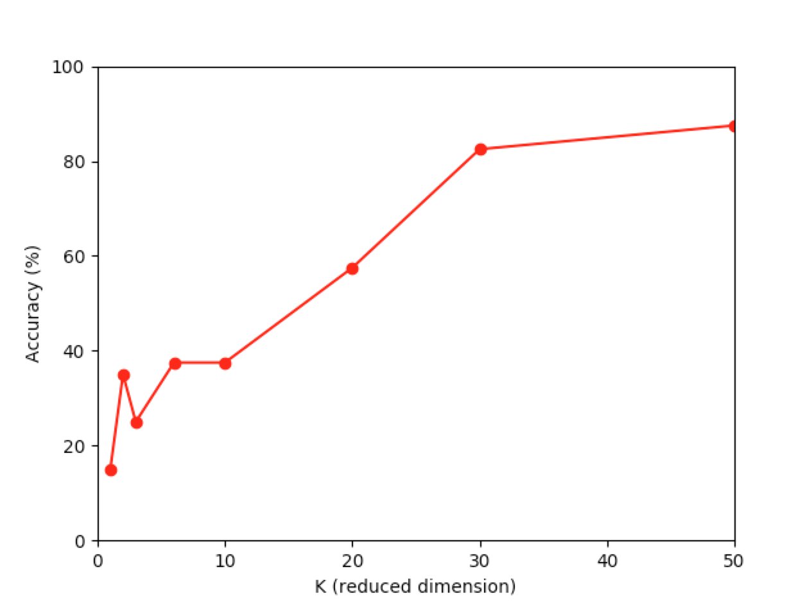

# PCA Facial Recognition Application

- Use PCA algorithm to reduce image features into k dimension, which builds a model to classify different people using facial features.
- Plot the accuracy rate vs K.



(Note: Training with CPU is quite slow and can take up to 15 mins 😕)

## Get started

> First time

```bash
make all
```

> After first time

```bash
make start
```


## Dependency:

- Python 3+
- numpy
- matplotlib
